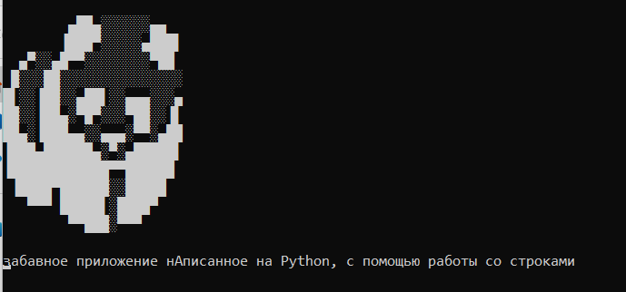

Рекламный боард

Сегодня я преподавал Python первому курсу и они проходили курсы
Я подумал написать одну штучку рад практики, но получилось прикольно
Думаю ее можно юзать как рекламный боард на каком нибудь мероприятии

Программа до ужаса проста. 
Сначла выводиться ASCII арт, после чего в строчке кадлая буква поднимается в верхний регистр

Смешного создателя можно найти тут --> https://linktr.ee/egorkapomidorka
